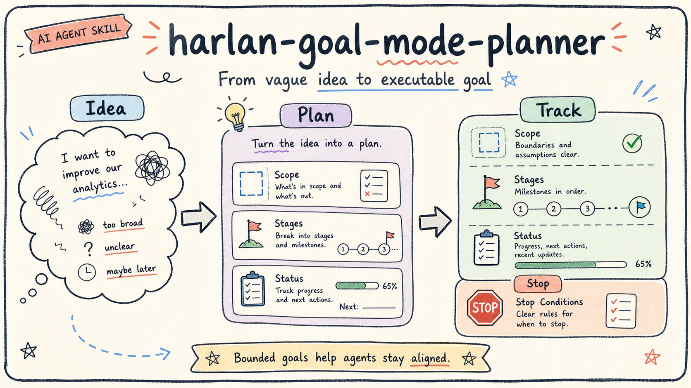

<div align="center">

# harlan-goal-mode-planner

**Turn vague intentions into clear long-running goals for AI agents.**

**English** | [简体中文](README.md)

[](https://github.com/Harlan66/harlan-goal-mode-planner/stargazers)
[](https://github.com/Harlan66/harlan-goal-mode-planner/forks)
[](https://github.com/Harlan66/harlan-goal-mode-planner/issues)
[](https://github.com/Harlan66/harlan-goal-mode-planner/commits/main)
[](LICENSE)

[Quickstart](#quickstart) · [When to Use](#when-to-use) · [Example Prompts](#example-prompts) · [What It Structures](#what-it-structures) · [Star](#star)

</div>



`harlan-goal-mode-planner` is a Goal planning Skill for AI agents. It turns a vague idea, long-running task, or incomplete request into an executable goal with clear boundaries, stages, progress tracking, acceptance criteria, and stop conditions.

Many agent tasks fail not because the model is weak, but because the goal is too broad, the scope is unclear, the stages are missing, and nobody defined what "done" or "stop" means. This Skill helps clarify the work before execution starts.

## Quickstart

If your tool supports `skills add`, install it directly:

```bash
npx skills add Harlan66/harlan-goal-mode-planner
```

You can also install it manually:

```bash
git clone https://github.com/Harlan66/harlan-goal-mode-planner.git
cp -R harlan-goal-mode-planner ~/.codex/skills/harlan-goal-mode-planner
```

After installation, describe your rough goal and ask your AI agent to use this Skill:

```text
Use harlan-goal-mode-planner to turn this idea into a goal suitable for long-running agent work.
```

If your tool does not support automatic Skill loading, open `SKILL.md` and provide those instructions to your AI agent manually.

## When to Use

- You have a rough idea but not an executable goal.
- You already wrote a Goal, but it may be too broad, vague, or easy to derail.
- You need to turn a long-running task into stages, deliverables, and acceptance criteria.
- You want to separate what the agent can organize from what the user must decide.
- You want the agent to confirm scope, inputs, pause conditions, and completion criteria before execution.

## Example Prompts

```text
Diagnose whether this Goal has clear boundaries, reasonable stages, and explicit acceptance criteria.
```

```text
I want to organize my content assets over time. First help me rewrite this intention as an executable Goal.
```

```text
Turn the rough request below into a long-running AI agent goal, and list the questions I need to answer first.
```

## What It Structures

- Background
- Final objective
- Current stage
- Available inputs
- Scope and out of scope
- Stage plan
- Status table
- Deliverables
- Acceptance criteria
- Stop conditions
- Human decision points

## Repository Contents

```text
harlan-goal-mode-planner/
├── README.md
├── README.en.md
├── SKILL.md
├── agents/
└── assets/
```

- `README.md`: Chinese usage guide.
- `README.en.md`: English usage guide.
- `SKILL.md`: core instructions read by the AI agent.
- `agents/openai.yaml`: display metadata.
- `assets/`: README illustrations.

## Relationship to harlan-skills

This is a standalone Skill repository. More Harlan Skills are indexed here:

[Harlan66/harlan-skills](https://github.com/Harlan66/harlan-skills)

## Star

If this Skill helps you clarify complex work before running an AI agent, please consider giving the repository a Star.

Stars help more people discover the project and help me decide which Skills to improve next.

## License

MIT License.
