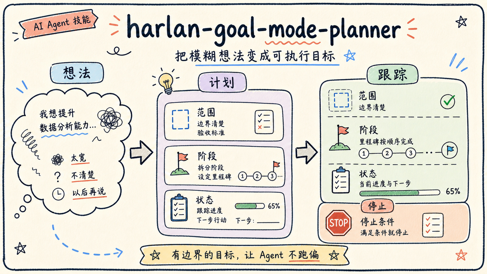

<div align="center">

# harlan-goal-mode-planner

**把模糊想法整理成适合 AI Agent 长时间执行的清晰目标。**

[English](README.en.md) | **简体中文**

[](https://github.com/Harlan66/harlan-goal-mode-planner/stargazers)
[](https://github.com/Harlan66/harlan-goal-mode-planner/forks)
[](https://github.com/Harlan66/harlan-goal-mode-planner/issues)
[](https://github.com/Harlan66/harlan-goal-mode-planner/commits/main)
[](LICENSE)

[快速开始](#快速开始) · [适合什么时候用](#适合什么时候用) · [使用示例](#使用示例) · [它会整理什么](#它会整理什么) · [Star 支持](#star-支持)

</div>



`harlan-goal-mode-planner` 是一个面向 AI Agent 的 Goal 规划 Skill。它用于把一句模糊想法、一个长期任务或一段不完整需求，整理成边界清楚、阶段明确、可以跟踪、可以验收、也知道何时停止的执行目标。

很多 Agent 任务失败，不是因为模型不够强，而是因为目标太宽、范围不清、缺少阶段、没有验收标准，也没有停止条件。这个 Skill 解决的是“开始之前先把目标讲清楚”的问题。

## 快速开始

如果你的工具支持 `skills add`，可以直接安装：

```bash
npx skills add Harlan66/harlan-goal-mode-planner
```

也可以手动安装：

```bash
git clone https://github.com/Harlan66/harlan-goal-mode-planner.git
cp -R harlan-goal-mode-planner ~/.codex/skills/harlan-goal-mode-planner
```

安装后，在对话中直接描述你的目标草稿，并要求 AI 使用这个 Skill：

```text
请使用 harlan-goal-mode-planner，把这个想法整理成适合长期执行的 Goal。
```

如果你的工具不支持自动加载 Skills，也可以打开 `SKILL.md`，把里面的规则交给 AI 使用。

## 适合什么时候用

- 你只有一个粗略想法，还没有整理成可执行目标。
- 你已经写了 Goal，但担心它太宽、太空或容易跑偏。
- 你要把一个长期任务拆成阶段、交付物和验收标准。
- 你需要明确哪些判断应由使用者确认，而不是让 AI 自己决定。
- 你希望 Agent 在执行前先确认边界、输入、暂停条件和完成标准。

## 使用示例

```text
请诊断这个 Goal 是否边界清楚、阶段合理、验收标准明确。
```

```text
我想长期整理自己的内容资产，请先帮我把这个想法改写成一个可执行 Goal。
```

```text
请把下面这段模糊需求整理成适合 AI Agent 连续执行的目标，并列出需要我确认的问题。
```

## 它会整理什么

- 目标背景
- 最终目标
- 当前阶段
- 可用输入
- 范围和不做什么
- 分阶段计划
- 状态跟踪表
- 交付物
- 验收标准
- 停止条件
- 需要使用者确认的判断点

## 仓库内容

```text
harlan-goal-mode-planner/
├── README.md
├── README.en.md
├── SKILL.md
├── agents/
└── assets/
```

- `README.md`：中文使用说明。
- `README.en.md`：英文使用说明。
- `SKILL.md`：AI Agent 读取的核心规则。
- `agents/openai.yaml`：展示信息。
- `assets/`：README 配图。

## 和 harlan-skills 的关系

这个仓库是独立 Skill 仓库。更多 Harlan Skills 可以从索引仓库查看：

[Harlan66/harlan-skills](https://github.com/Harlan66/harlan-skills)

## Star 支持

如果这个 Skill 帮你把复杂任务讲清楚、跑稳一点，欢迎给这个仓库点一个 Star。

你的 Star 会帮助更多人发现它，也会帮助我判断哪些 Skills 值得继续完善。

## 许可证

MIT License。
